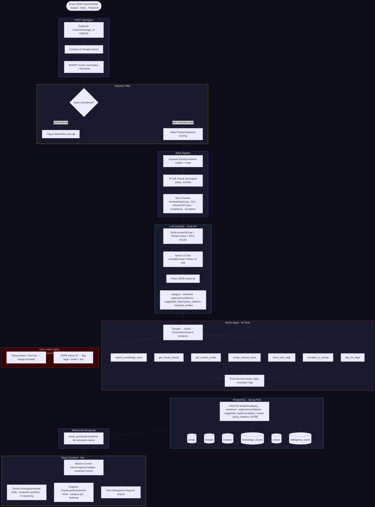

# SenAI CRM

An AI-powered B2B customer support CRM that automatically triages incoming emails using LLM classification, RAG knowledge retrieval, and an autonomous ReAct agent that decides whether to escalate or auto-reply.



---

## Table of Contents

1. [Project Overview](#project-overview)
2. [Tech Stack](#tech-stack)
3. [Setup](#setup)
4. [Architecture Decisions](#architecture-decisions)
5. [How the ReAct Agent Works](#how-the-react-agent-works)
6. [Running Email Simulation](#running-email-simulation)
7. [Special Scenario Handling](#special-scenario-handling)
8. [Database Schema](#database-schema)
9. [API Reference](#api-reference)
10. [Known Limitations](#known-limitations)

---

## Project Overview

SenAI CRM ingests customer support emails through a four-stage AI pipeline:

```
Email JSON → Heuristic Filter → RAG Retrieval → LLM Classification → ReAct Agent → PostgreSQL → WebSocket → React UI
```

**Key features:**
- **Real-time inbox** with urgency badges, sentiment scores, spam detection, and tabs for escalated/replied/flagged threads
- **Thread Workspace** — 3-panel view with email body, entity highlighting, sentiment sparkline timeline, and full AI reasoning trace
- **Analytics Dashboard** — sentiment trend chart, category pie chart, at-risk accounts list, agent performance metrics, volume heatmap
- **RAG Debug panel** — live keyword search over 6 policy documents
- **Bulk simulation** — ingest and classify 60 real-world emails via a single API call, with rate-limit-safe sequential processing

---

## Tech Stack

| Layer | Technology |
|---|---|
| Runtime | Node.js 24, TypeScript 5.9 |
| API server | Express 5, WebSocket (ws) |
| Database | PostgreSQL via Replit native integration, raw `pg.Pool`, no ORM |
| AI | Groq API — `llama-3.3-70b-versatile` |
| Frontend | React 18, Vite, Wouter (routing), Recharts |
| Build | esbuild (ESM bundle) |
| Monorepo | pnpm workspaces |

---

## Setup

The only thing you need to provide is your Groq API key. Everything else (database, server, frontend) is pre-configured.

**On Replit:**
1. Open the **Secrets** tab (lock icon in the sidebar)
2. Add a secret: `GROQ_API_KEY` → your key from [console.groq.com](https://console.groq.com)
3. Both workflows (`API Server` and `web`) will restart automatically

**The database is provisioned automatically** via Replit's native PostgreSQL integration. `runMigrations()` runs on every server start and creates all tables idempotently using `CREATE TABLE IF NOT EXISTS`.

**To seed with test emails**, hit the Simulate button in the top-right of the inbox, or:

```bash
curl -X POST https://<your-replit-domain>/api/simulate
```

This ingests 60 emails from `email-data-advanced.json` and runs full LLM classification on each one sequentially (2-second delay between requests to stay within Groq rate limits). Classification takes approximately 2 minutes for all 60 emails.

---

## Architecture Decisions

### Why Groq instead of OpenAI?

Groq runs `llama-3.3-70b-versatile` on custom LPU (Language Processing Unit) hardware, delivering inference speeds 10–20× faster than equivalent GPU-hosted models. For a CRM where classification latency directly affects agent response time, this matters. Cost per token is also substantially lower than OpenAI GPT-4-class models.

The trade-off: Groq has stricter rate limits (requests-per-minute) than OpenAI. This is handled by:
- 3-attempt retry with 2-second backoff on HTTP 429
- Sequential processing in the simulate route (not parallel) with a 2-second delay between emails
- Auto-reclassify on startup that re-queues any emails where `confidence = 0` (which indicates a failed classification from a previous run)

### Why keyword-based RAG instead of a vector database?

The knowledge base consists of 6 small, structured policy documents (pricing, SLA, refund, API docs, compliance, escalation). For this domain:

| Approach | Pros | Cons |
|---|---|---|
| **Keyword TF-IDF (current)** | Zero cost, zero latency, zero infra, exact policy term matching | Misses semantic similarity (e.g. "cancel" won't match "termination") |
| **Vector embeddings + pgvector** | Semantic search, handles paraphrase | Embedding API cost per doc + query, extra infra, overkill for 6 documents |
| **Hosted vector DB (Pinecone, Weaviate)** | Scales to millions of docs | Massive overkill, adds external dependency, cost |

For a fixed 6-document policy corpus where users write emails using the same terminology as the policies, keyword matching is accurate enough and has no operational cost. The trade-off is clearly documented: if the corpus grows beyond ~50 documents or covers highly paraphrased domains, switching to `pgvector` with `text-embedding-3-small` would be the right call.

### Why no ORM?

Raw `pg.Pool` with hand-written DDL in `runMigrations()` gives complete transparency over schema evolution. There are no hidden N+1 queries, no migration files to track across environments, and no abstraction layer between the query and the database. The schema is small enough (8 tables) that this is a net win.

---

## How the ReAct Agent Works

The agent runs a **Thought → Action → Observation** loop (maximum 6 iterations) after every email is classified.

```
Classified Email
      │
      ▼
 Hard-coded safety checks (run BEFORE the LLM loop)
      │
      ▼
 System prompt + email context + classification result
      │
      ▼
 ┌─────────────────────────────────────────────────┐
 │  LLM generates:                                 │
 │  { "thought": "...",                            │
 │    "action": "tool_name",                       │
 │    "action_input": { ... } }                    │
 └─────────────────────────────────────────────────┘
      │
      ▼
 Tool executes → observation appended to context
      │
      ▼
 Repeat until action = "FINISH" or max steps reached
      │
      ▼
 Final action written to `actions` table
```

**The 7 tools available to the agent:**

| Tool | What it does |
|---|---|
| `search_knowledge_base` | TF-IDF search over the 6 policy documents |
| `get_thread_history` | Fetches all prior emails in the same thread |
| `get_contact_profile` | Pulls contact record including account value and churn risk score |
| `escalate_to_human` | Writes an `actions` row with `action_type = Escalate`, flags `requires_human = true` |
| `flag_for_legal` | Writes a legal-flag action, used for GDPR and cease-and-desist |
| `create_internal_ticket` | Creates a row in `internal_tickets` with assignee and priority |
| `send_auto_reply` | Writes an `actions` row with `action_type = Auto-Reply` and the drafted response |

**Hard-coded safety overrides** (run before the LLM loop, cannot be bypassed by the agent):

1. **Security/Ransomware** — if `category = Security` or the escalation reason contains "ransomware", the agent immediately calls `escalate_to_human` with priority `Critical` and exits. The LLM never generates a reply.
2. **GDPR Article 20** — if `category = Compliance` and the email body contains "portab" (data portability), the agent calls `flag_for_legal`, `create_internal_ticket` (assignee: `privacy@company.com`), and `send_auto_reply` with the statutory 30-day acknowledgement text — all without entering the LLM loop.

---

## Running Email Simulation

The simulation route (`POST /api/simulate`) reads `email-data-advanced.json` from the project root and processes all 60 emails.

**Two-phase processing (important design note):**

Phase 1 inserts all 60 emails into the database instantly (no Groq calls, just DB writes). Phase 2 classifies them one at a time with a 2-second delay between each request. This design means:
- The inbox populates immediately after you hit Simulate
- Classification results arrive over the next ~2 minutes as the LLM processes each email
- If Groq returns a 429, the retry logic handles it; if classification still fails, the email is skipped with a warning log and the loop continues

**Monitoring progress:**

```bash
GET /api/reclassify-all/status
# Returns: { pending: 12, done: 48, total: 60 }
```

**Re-running classification on failed emails:**

```bash
POST /api/reclassify-all
# Returns immediately: { status: "started", count: 12 }
# Background loop runs sequentially with 2s delay
```

This endpoint is also **called automatically on server startup** if more than 10 emails have `confidence = 0` or `category IS NULL`.

---

## Special Scenario Handling

The test dataset (`email-data-advanced.json`) contains several emails specifically designed to test edge-case handling.

### Ransomware / Security Threat

**Trigger:** Email body contains `ransomware`, `your files are encrypted`, `send 2 btc`, or similar extortion language.

**Pipeline:**
1. Heuristic filter raises `SECURITY` flag, sets urgency = `Critical`
2. LLM classifier independently confirms `category = Security` (two-layer detection)
3. Agent hard-coded override fires **before** the LLM loop — calls `escalate_to_human` immediately
4. `suggested_reply` is always `null` for security emails — no auto-reply is ever drafted

### GDPR Data Portability Request

**Trigger:** Email mentions `Article 20`, `data portability`, or both `GDPR` + `portability`.

**Pipeline:**
1. Heuristic filter raises `LEGAL` flag
2. LLM classifier sets `category = Compliance`, `urgency = Critical`, `requires_human = true`
3. Agent hard-coded override (Article 20 specific) runs immediately:
   - Calls `flag_for_legal` with the statutory obligation note
   - Creates an internal ticket assigned to `privacy@company.com`
   - Sends a statutory 30-day acknowledgement auto-reply
4. The full reasoning log is stored in `actions.agent_reasoning_log`

### Bob Jones (Repeat Escalating Customer)

Bob Jones (`bob.jones@enterprise.net`) appears multiple times in the test dataset with escalating frustration — a billing dispute followed by a security incident report.

**What the agent does:**
1. `get_contact_profile` retrieves his elevated `churn_risk_score` and `account_value`
2. `get_thread_history` shows the prior unresolved billing thread
3. The agent reasons that a high-value, high-churn-risk contact with a prior open issue warrants human escalation rather than auto-reply
4. `escalate_to_human` is called with the full context

### Karen (Retail Customer — Billing Dispute)

Karen (`karen.w@retail-co.com`) sends an angry billing dispute. Her email tests the agent's ability to:
1. Retrieve the relevant refund and billing policy chunks via `search_knowledge_base`
2. Draft a policy-compliant auto-reply citing the correct refund window
3. Decide whether to auto-reply (if frustration is moderate) or escalate (if sentiment is very negative)

The LLM sentiment score on Karen's emails typically comes in at `−0.7` to `−0.9`, which the agent weighs against her `account_value` when making its decision.

---

## Database Schema


| Table | Purpose |
|---|---|
| `emails` | Core table — one row per email, holds all classification output |
| `threads` | Groups emails by `thread_id`, tracks `email_count` and `last_updated_at` |
| `contacts` | One row per sender, stores `account_value`, `churn_risk_score`, `company` |
| `knowledge_chunks` | TF-IDF-indexed chunks from the 6 policy documents, seeded on startup |
| `actions` | Agent decisions — auto-replies, escalations, legal flags, with full `agent_reasoning_log` JSONB |
| `internal_tickets` | Tickets created by the agent for human follow-up |
| `audit_log` | Append-only log of all mutations for compliance traceability |
| `intelligence_cache` | Web-enriched company profiles, cached to avoid re-fetching |

---

## API Reference

| Method | Path | Description |
|---|---|---|
| `POST` | `/api/ingest` | Ingest a single email, returns immediately, classifies async |
| `POST` | `/api/simulate` | Bulk-ingest all 60 test emails, returns `{ status: "started" }` |
| `GET` | `/api/dashboard/stats` | Counts by category, urgency, status |
| `GET` | `/api/dashboard/emails` | Paginated email list for the inbox |
| `GET` | `/api/threads/:threadId` | Full thread with all emails and actions |
| `GET` | `/api/analytics/sentiment` | Sentiment trend over time |
| `GET` | `/api/analytics/categories` | Category distribution |
| `GET` | `/api/analytics/at-risk` | Contacts with high churn risk |
| `GET` | `/api/rag/search?q=` | Live RAG search over knowledge base |
| `POST` | `/api/reclassify-all` | Re-run classification on all low-confidence emails |
| `GET` | `/api/reclassify-all/status` | Count of pending vs classified emails |
| `GET` | `/api/contacts/:email` | Contact profile with history |
| `GET` | `/api/intelligence/:email` | Web-enriched company intel (cached) |
| `GET` | `/api/healthz` | Health check |

WebSocket: connects to the same host, receives `{ type: "email_processed", emailId }` events on classification completion.

---

## Known Limitations

**Groq rate limits during bulk simulation**
Groq's free tier allows ~30 requests per minute on `llama-3.3-70b-versatile`. The simulate route processes one email every 2 seconds (~30/min), which sits right at the limit. Under burst conditions (multiple concurrent users, server restarts during simulation) you may see some emails classified as `category = Other` with `confidence = 0`. Hitting `POST /api/reclassify-all` will re-queue and fix them.

**Keyword RAG misses semantic synonyms**
The RAG pipeline uses TF-IDF keyword overlap, not semantic embeddings. An email that says "I want to terminate my contract" will not retrieve the "cancellation policy" chunk unless the word "cancel" appears somewhere in the email. Mitigation: the LLM classifier has the policy chunks available in the prompt, so it can still reason correctly — the RAG just won't surface the most relevant chunk.

**No authentication layer**
All API endpoints are public. This is intentional for the assessment context but would require Replit Auth or JWT middleware before production use.

**Agent actions are not actually executed**
The `send_auto_reply`, `apply_discount`, and similar agent tools write rows to the `actions` table with `is_approved = false`. They do not send real emails or modify real billing systems. A human approval step would be needed to promote them to executed.

**Single-tenant only**
There is no concept of teams, workspaces, or per-user data isolation. All emails and contacts are shared across all sessions.

**Knowledge base is static**
The 6 policy documents are read from disk at startup and chunked once into `knowledge_chunks`. Adding a new document requires restarting the server.
