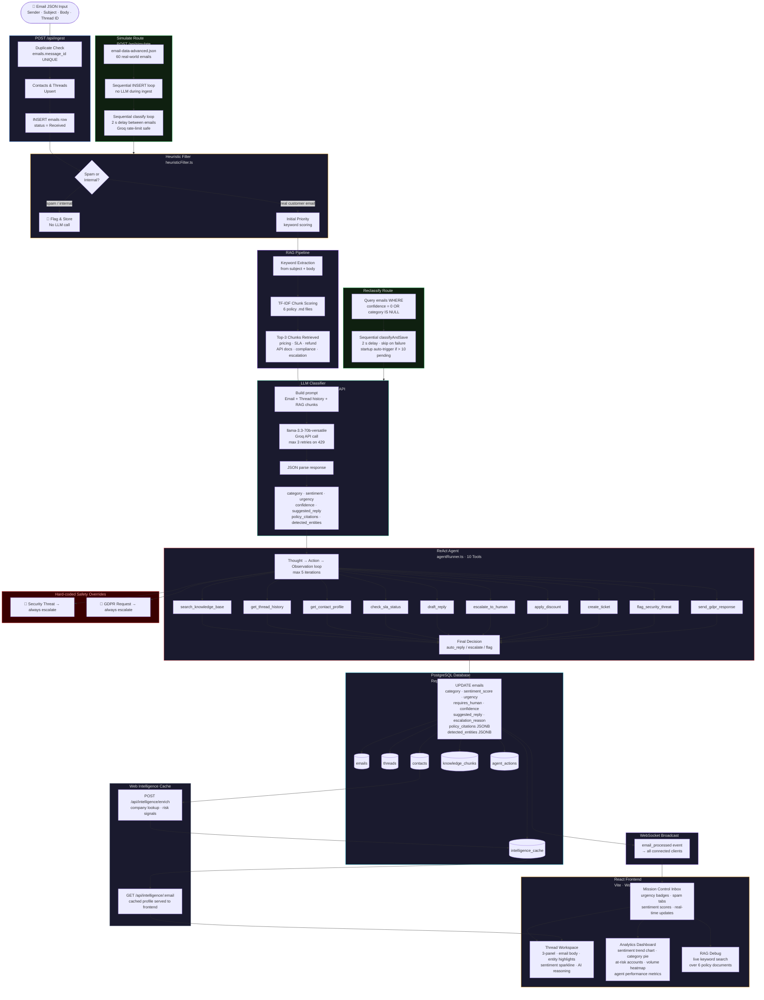

# SenAI CRM — System Architecture

## Component Summary

| Component | File | Description |
|---|---|---|
| **Heuristic Filter** | `services/heuristicFilter.ts` | Regex + keyword scoring — spam, internal, initial priority. Zero LLM cost. |
| **RAG Pipeline** | `services/ragPipeline.ts` | TF-IDF keyword search over 6 policy `.md` files. No embeddings, no vector DB. |
| **LLM Classifier** | `services/llmClassifier.ts` | Groq `llama-3.3-70b-versatile`. Outputs category, sentiment, urgency, confidence, suggested reply, policy citations, detected entities. |
| **ReAct Agent** | `services/agentRunner.ts` | Thought → Action → Observation loop (max 5 iterations). 10 tools. Hard-coded safety overrides for security threats and GDPR. |
| **Sentiment Tracker** | `services/sentimentTracker.ts` | Maintains rolling sentiment timeline per contact and thread. |
| **classifyAndSave** | `services/classifyAndSave.ts` | Shared helper: RAG → LLM → DB update → Agent. Used by ingest, simulate, and reclassify routes. |
| **PostgreSQL** | `db.ts` | Raw `pg.Pool`, no ORM. All DDL in `runMigrations()`. 6 tables. |
| **WebSocket** | `index.ts` | `ws` server. Broadcast wired via `app.locals.broadcast`. Real-time inbox updates. |
| **Reclassify Route** | `routes/reclassify.ts` | `POST /api/reclassify-all` — sequential re-classification with 2 s delay. Auto-triggered on startup if > 10 emails have null confidence. |
